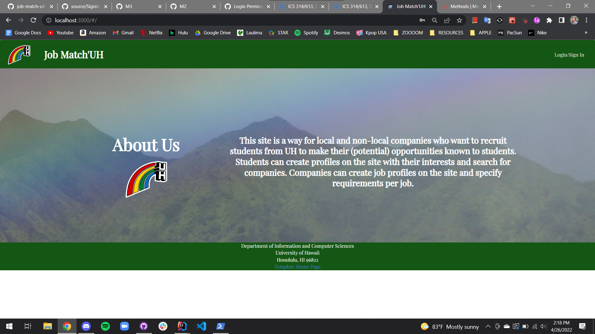
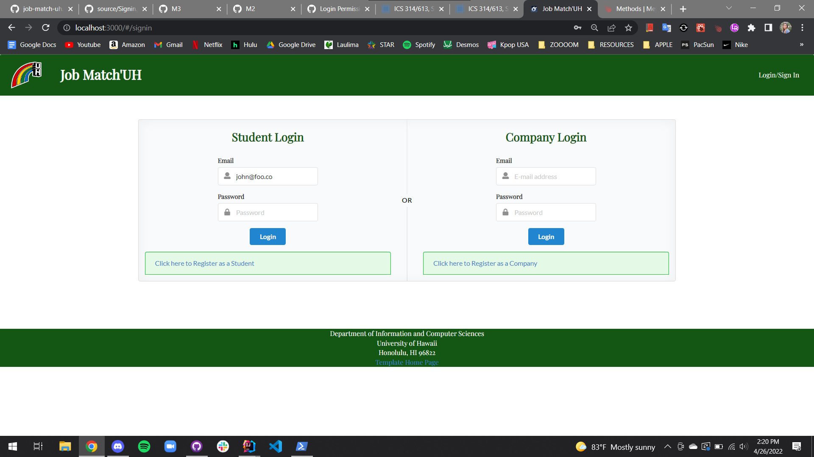
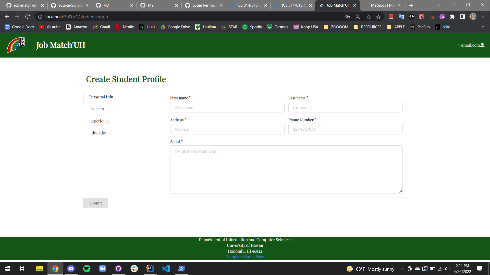
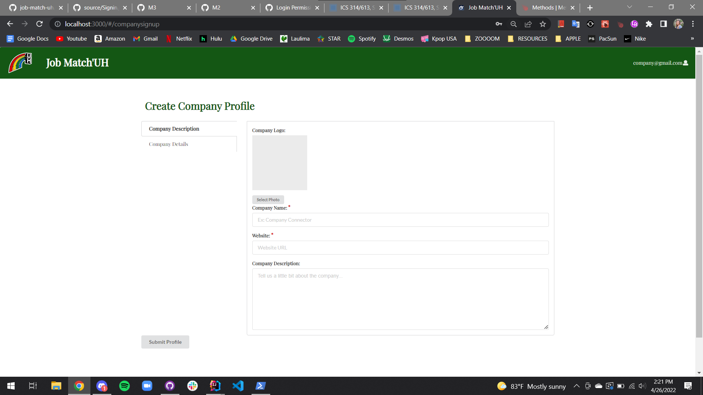
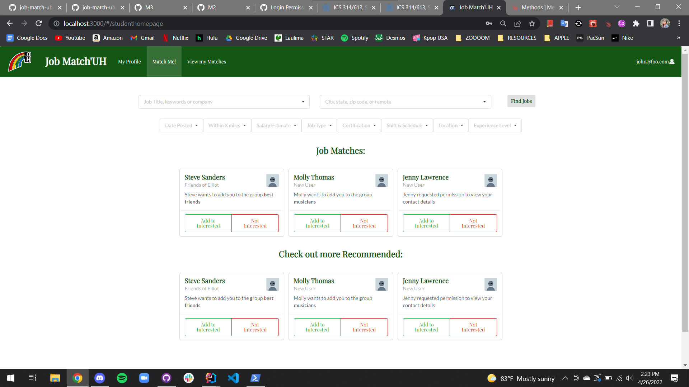
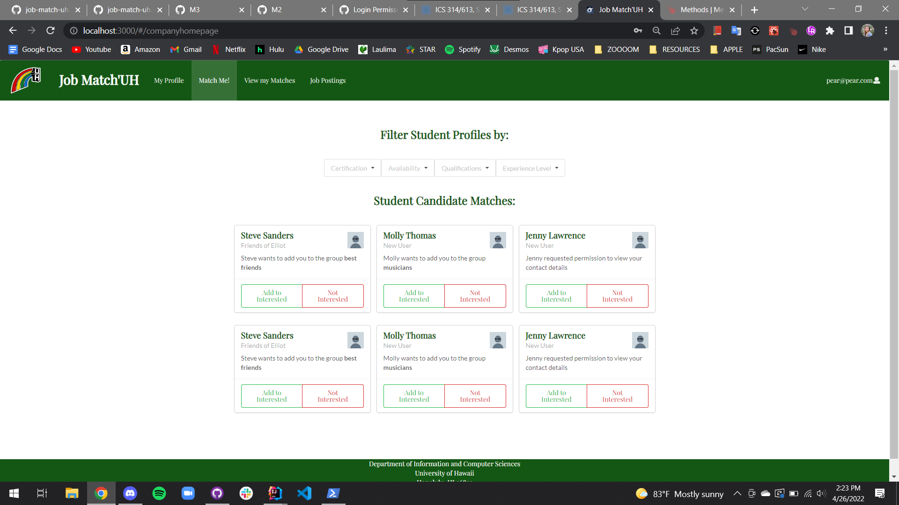
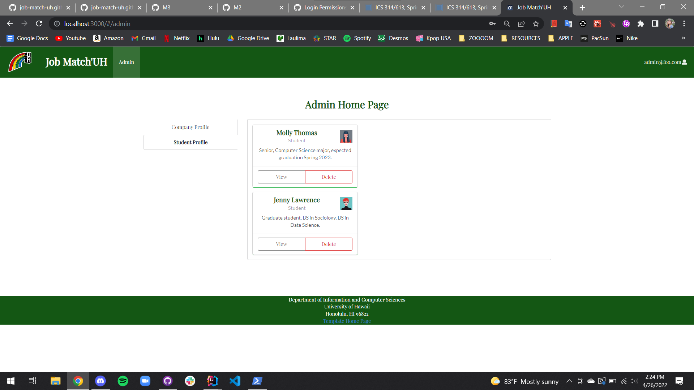
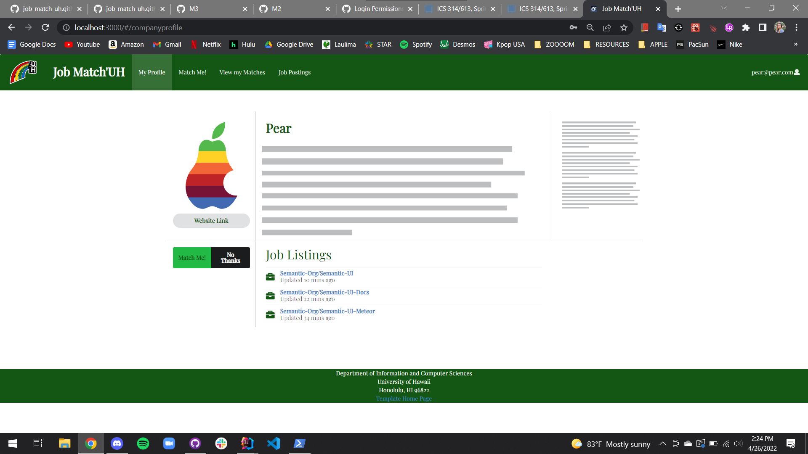
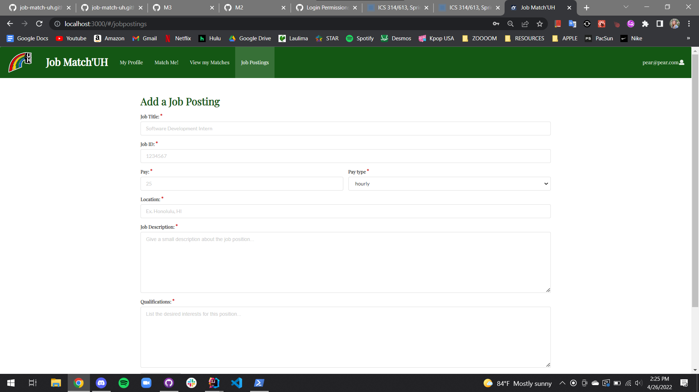

## Table of contents

* [Overview](#overview)
* [Our Approach](#our-approach)
* [User Guide](#user-guide)
* [Our Team](#our-team)
* [Team Contract Google Doc](#team-contract)
* [Deployment](#deployment)
* [Current State of Project](#current-state-of-project)
* [M1 Project Page](#m1-project-page)
* [M2 Project Page](#m2-project-page)
* [M3 Project Page](#m3-project-page)

## Overview

### The problem
Many UH computer science and engineering students want to learn about internship and job opportunities, but currently they must wait until a company decides to visit the campus or send out some sort of announcement. There is no efficient way for students to understand the “landscape” of internship and job opportunities that might be available in the future, so they can prepare for them now.

### The solution
The Company Connector web application provides a new way for local and non-local companies who want to recruit students from UH to make their (potential) opportunities known to students. At the same time, students can create profiles on the site with their interests, experiences, and more. The site can match students to potential employers and vice-versa.

## Our Approach

Instead of sending out announcements each year, a company can create a page in the site that lists:

* A brief overview of the company.
* Geographic location of the company.
* A list of positions that they commonly recruit for from new UH graduates. Each position has a brief description, a set of skills, whether it’s an internship, permanent position, or both, how many people they would like to hire, and salary range.
* Links to the company’s main website for additional information.
* Contact email(s)/text messages for followup.
* Students who visit the site can create a profile with their interests (skills), preferred geographic location, and link to their professional portfolio page.

Admins can monitor the site for inappropriate content and create new categories of skills and geographic locations.

## Developer Guide

The following will be used to create the app:

Meteor for Javascript-based implementation of client and server code.
React for component-based UI implementation and routing.
Semantic UI React CSS Framework for UI design.
Uniforms for React and Semantic UI-based form design and display.

## User Guide

These are the mockup pages that will be used for the final project.

### Landing Page

The landing page is presented to users when they visit the top-level URL to the site.

Upon entering the site, users can:
* Login or Sign Up
* Read an About Us

Mockup: 

### Sign in / Sign up Page

This is what the sign in page will look like. There will be two cards for student log in and company log in. If they do not have an account they can register one below in a redirected link. 

Mockup: 

### Create Student Profile Page

New student users need to register a student account. New users need to finish creating certain aspects of their account before gaining access to the entire site and companies.

Mockup: 

### Create Company Profile Page

New company users need to register a company account. New users need to finish creating certain aspects of their account before gaining access to the entire site and companies.

Mockup: 

### Student home page

The student home page suggests companies that are hiring according to their desired interests.

Mockup: 

### Company home page

The company home page lists all the students whose interests, experience, and skills match their company’s needs. The page will be organized by job position and have the option to filter the group of students who matched the job description.

Mockup: 

### Admin home page

Edit feature to control profiles and/or delete any “false” profiles or violating profiles.

Mockup: 

### Student profile page (Projects, Profiles, Interests)

The Student profile page showcases a student’s interests, prior/current experience, and more. On this page, signed in students can edit and add to their profile. 

Mockup: 

### Company profile 

The Company profile page allows companies to talk about their organization, post jobs, and more. Company administrators can add to their job section, edit their description, etc.

Mockup: 

## Our Team

Company Connector is designed and implemented by Larissa Tsai, Michelle Leano, Eda Cadiena, Gaila Galano, Cameron Arakaki.

### Team Contract
[Team Contract Google Doc](https://docs.google.com/document/d/1xsRcfiE0334OsBBOehHa-V0ejjmF4cmbaKmLs2_oX2E/edit?usp=sharing)

### Deployment

[Click here](http://143.244.183.134)

### Current State of Project

This is what our Project currently looks like. For now, we mainly focused on fixing the details of our layout so that users, both companies and students, are able to find each other. Finally, we slowly implemented functionality so that users can login or create an account according to their role (student or company). Further functionailty will be implemented in the next milestone.

### Landing Page

### Sign in / Sign up Page

### Create Student Profile

### Create Company Profile

### Student Home Page

### Company Home Page

### Admin home page

### Student Profile

### Company Profile

### Job Posting page

### M1 Project Page

Click on [this link here](https://github.com/Job-Match-UH/source/projects/1) to view our Milestone 1 (M1) Project Page. This shows the issues that were completed for the milestone at this time. 

### M2 Project Page

Click on [this link here](https://github.com/Job-Match-UH/source/projects/2) to view our Milestone 2 (M2) Project Page. This shows the issues that were completed for the milestone at this time. 

### M3 Project Page

Click on [this link here](https://github.com/Job-Match-UH/source/projects/3) to view out Milestone 3 (M3) Project Page. This shows the issues taht were completed for the milestone at this time.
