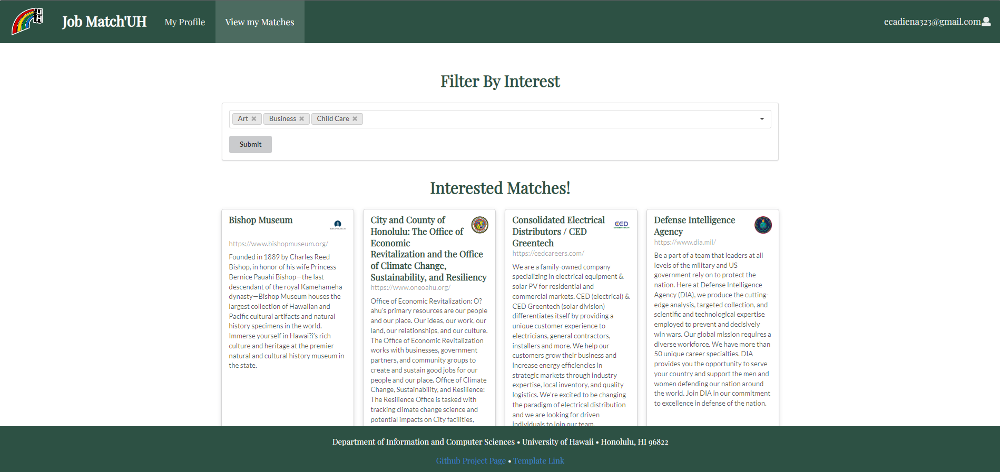
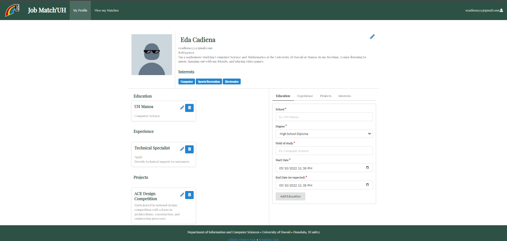

## Table of contents

* [Overview](#overview)
* [Our Approach](#our-approach)
* [Developer Guide](#developer-guide)
* [User Guide](#user-guide)
* [Deployment](#deployment)
* [Current State of Project](#current-state-of-project)
* [Community Feedback](#community-feedback)
* [M1 Project Page](#m1-project-page)
* [M2 Project Page](#m2-project-page)
* [M3 Project Page](#m3-project-page)
* [Our Team](#our-team)
* [Team Contract Google Doc](#team-contract)

## Overview

### The problem
Many UH computer science and engineering students want to learn about internship and job opportunities, but currently they must wait until a company decides to visit the campus or send out some sort of announcement. There is no efficient way for students to understand the “landscape” of internship and job opportunities that might be available in the future, so they can prepare for them now.

### The solution
The Company Connector web application provides a new way for local and non-local companies who want to recruit students from UH to make their (potential) opportunities known to students. At the same time, students can create profiles on the site with their interests, experiences, and more. The site can match students to potential employers and vice-versa.

## Our Approach

Instead of sending out announcements each year, a company can create a page in the site that lists:

* A brief overview of the company.
* Geographic location of the company.
* A list of positions that they commonly recruit for from new UH graduates. Each position has a brief description, a set of skills, whether it’s an internship, permanent position, or both, how many people they would like to hire, and salary range.
* Links to the company’s main website for additional information.
* Contact email(s)/text messages for followup.
* Students who visit the site can create a profile with their interests (skills), preferred geographic location, and link to their professional portfolio page.

Admins can monitor the site for inappropriate content and create new categories of skills and geographic locations.

# Developer Guide

The following will be used to create the app:

Meteor for Javascript-based implementation of client and server code.
React for component-based UI implementation and routing.
Semantic UI React CSS Framework for UI design.
Uniforms for React and Semantic UI-based form design and display.

## Backend System

This application was built on meteor-application-template-react.  For information regarding this template, please refer to [https://ics-software-engineering.github.io/meteor-application-template-react/](https://ics-software-engineering.github.io/meteor-application-template-react/)


## Installation

First, [install Meteor](https://www.meteor.com/install).

Second, [download a copy of Job Match'UH](https://github.com/Job-Match-UH/source).

Third, cd into the app directory and install the required libraries:

```
cd /path/to/peer-review-finder
cd app
meteor npm install
```


## Running the system

Once the libraries are installed, you can run the application by invoking:

```
meteor npm run start
```


## Viewing the running app

If all goes well, the template application will appear at [http://localhost:3000](http://localhost:3000).


## ESLint

You can verify that the code obeys our coding standards by running ESLint over the code in the imports/ directory with:

```
meteor npm run lint
```

## User Guide

These are the mockup pages that will be used for the final project.

### Landing Page

The landing page is presented to users when they visit the top-level URL to the site.

Upon entering the site, users can:
* Login or Sign Up
* Read an About Us

Mockup: 

### Sign in / Sign up Page

This is what the sign in page will look like. There will be two cards for student log in and company log in. If they do not have an account they can register one below in a redirected link. 

Mockup: 

### Create Student Profile Page

New student users need to register a student account. New users need to finish creating certain aspects of their account before gaining access to the entire site and companies.

Mockup: 

### Create Company Profile Page

New company users need to register a company account. New users need to finish creating certain aspects of their account before gaining access to the entire site and companies.

Mockup: 

### Student home page

The student home page suggests companies that are hiring according to their desired interests.

Mockup: 

### Company home page

The company home page lists all the students whose interests, experience, and skills match their company’s needs. The page will be organized by job position and have the option to filter the group of students who matched the job description.

Mockup: 

### Admin home page

Edit feature to control profiles and/or delete any “false” profiles or violating profiles.

Mockup: 

### Student profile page (Projects, Profiles, Interests)

The Student profile page showcases a student’s interests, prior/current experience, and more. On this page, signed in students can edit and add to their profile. 

Mockup: 

### Company profile 

The Company profile page allows companies to talk about their organization, post jobs, and more. Company administrators can add to their job section, edit their description, etc.

Mockup: 

### Deployment

[Click here](https://jobmatchuh.xyz)

### Current State of Project

This is the final version of Job Match'UH. We focused on implementing functionality so that users can login, create an account according to their role (student or company), and matching students to compnies using interest filtering. Further styling details were implemented as much as possible to make the app more user friendly.

### Landing Page


### Sign in / Sign up Page


### Register Student Account Page


### Register Company Account Page


### Create Student Profile


### Create Company Profile


### Student Home Page



### Company Home Page


### Admin home page


### Student Profile



### Company Profile


### Job Posting page


## Community Feedback
We asked five UH community members for their opinions on our app. Here's what they had to say:

#### Leititia Le, Pre-Pharmaceutical said,
  *"The app's font is basic. Visually, the design could use more pictures, more color, and more styling. The signup process felt incomplete and was not user friendly. Could not find the edit page without some help. For the profile you could include additional options such as skills and accolades. A job search bar at the top of the page might be a nice inclusion to search for specific companies or locations with the ability to filter differences between each. Also an inbox/messages area where you can send & receive drafts would be a nice touch."*
  
#### Alysha Leano, Information Security and Assurance, said,
  *"I like this app. It did its job in matching the user to job suggestions so that in it of itself is a success. The program ask for a sufficient amount of information from the user in order to match them properly to potential employees. Everything but the interests seem a bit “unnecessary” in this elementary step of matching strictly to interests however. What is the rest of my information used for?
Additionally, I personally like to work on smaller windows so I suggest making it more user friendly in that way. Resizing to a smaller window moved objects out of their spot or put them in a position that made them blocked by the footer. I think it’d also be helpful to include having a return button from search/edit. I have to use the back button in my browser to return to the previous which is kind of inconvenient. Adding on to that, I think it would be helpful that the site caches what the last searched interest was when returning from looking at companies/job positions. That way I won’t have to reclick my all my interests again. Or, the application can take the interests I’ve already inputted on my personal info and do an “apply my interests” type of checkbox/button."*

#### Dalten Pang, Mechanical Engineering and Computer Science, said,
 *"The website works for the most part, with some minor hiccups here and there. The main thing was some of the tags breaking the website, from both account types - company and individual. An example is the Art tag when searching from the company perspective broke the website. With tags there was also the possibility to have duplicate interest tags if the same tags are added at separate times. There's also the minor inconvenience that the website logs you out after creating your profile, you'd ideally be put into the main page. Some small UI gripes including the misalignment of descriptions and headers in the about company page. The website of the companies leaves a gap between the name of the company and the website when searching from the Individual's perspective. The website link also sometimes sticks outside the container, as with Grace Pacific LCC. When adding phone numbers it would be a nice thing if it auto formatted.Overall the website is nice and simple."*

### M1 Project Page

Click on [this link here](https://github.com/Job-Match-UH/source/projects/1) to view our Milestone 1 (M1) Project Page. This shows the issues that were completed for the milestone at this time. 

### M2 Project Page

Click on [this link here](https://github.com/Job-Match-UH/source/projects/2) to view our Milestone 2 (M2) Project Page. This shows the issues that were completed for the milestone at this time. 

### M3 Project Page

Click on [this link here](https://github.com/Job-Match-UH/source/projects/3) to view out Milestone 3 (M3) Project Page. This shows the issues taht were completed for the milestone at this time.

## Our Team

Company Connector is designed and implemented by Michelle Leano, Eda Cadiena, Cameron Arakaki, Gaila Galano, Larissa Tsai.

### Team Contract
[Team Contract Google Doc](https://docs.google.com/document/d/1xsRcfiE0334OsBBOehHa-V0ejjmF4cmbaKmLs2_oX2E/edit?usp=sharing)
